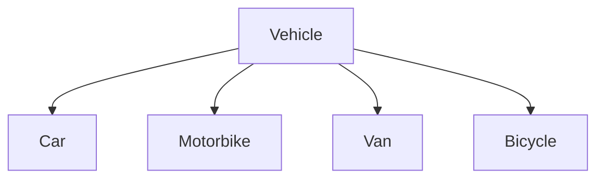
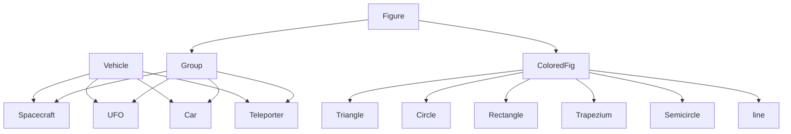

# Project 3

## **Team info**

**Team** : `p3team-06`  

**Contributors** :  
`Chengbo Xu` 524370910111  
`Yuxiang Cai` 524370910013  
`Siyuan Ye` 524370910206  
`Yihao Ma` 524370910259  

## **Project Overview**
- This project aims to deeply understand `Object-Oriented Programming` and focus on applying `classes`, `inheritance`, and `polymorphism` to implement a parking lot management system and an interstellar parking lot simulation drawing. The project is divided into two parts: the design of a **regular parking lot management software** and the drawing of an **interstellar parking lot** using the OpenGL library.

## **Part of Pms (Regular Parkinglot)**
### **Hierarchy diagram**

### **Overview**
- Support a two-floors parking lots.
- Accommodate multiple vehicle types (van, car, motorcycle, bicycle).
- Calculate the fee based on the vehicle type and parking duration.
- Provide an entry ticket including entry time, vehicle type, and vacancy hint information when a vehicle enters; provide parking duration, vehicle type, and fee information when a vehicle exits.
- **Surprise : CLI (Command Line Interface) is applied to implement the program!**
  
### **Detail Information**
- Cost of Van: 3 yuan/second (Can be adjusted by the user)
- Cost of Car: 2 yuan/second (Can be adjusted by the user)
- Cost of Motorcycle: 1 yuan/second (Can be adjusted by the user)
- Cost of Bicycle: 0.5 yuan/second (Can be adjusted by the user)
- **The number of the vehicles and the capacity of each floor can be adjusted by the user.**
- Parking duration: randomly generated between 10 and 15 seconds (Can be adjusted by the user)
- The time gap between two vehicles is 10 seconds.

### **How to run the program**
1. Ensure that you are in a **Linux environment** (e.g. Ubuntu).
2. Open the terminal and navigate to the directory  `p3team-06/scr/pms`
3. Input "**make**" to compile the program.
4. Input "**./pms -h**" or "**./pms --help**" to view the help message.
   - You will see the following message:
   - `-h|--help              Print this help message`
   - `-n n|--car-number=n    Specify number of cars, n must be larger than 8 (default: 10)`
   - `-f1 c|--floor1=c       Specify number of the capcity floor1, c must be larger than 5 (default: 8)`
   - `-f2 d|--floor2=d       Specify number of the capcity floor1, d must be larger than 5 (default: 6)`
5. Input the varibles' number you want to set.(You can view the default values in help message)
   - e.g   "**./pms -n 8 -f1 8 -f2 10**" to set the number of cars to 8, the first floor's capacity to 8 and the second floor's capacity to 10.
6. Press Enter to start the project!!!

## **Part of Ipa (Interstellar Parkinglot)**
### **Hierarchy diagram**

### **Overview**
 - Contain at least twelve parking slots, at most twenty-two parking slots, with the number and type of vehicles randomly set, and an entrance barrier and an exit barrier.
 - Vehicle types include Teleporter (reserved parking space marked with a randomly changing color rectangle), UFO (self-spinning device), Spacecraft (continuously zooming in and out), and regular car.
 - Vehicle movement follows specific rules: after the entrance opens, drive from the entrance to an empty space, follow a smooth trajectory, and reverse into the space along a smooth curve after reaching the empty space.

### **Detail Information**  
- Cost of Car: 2 dollars/hour (Can be adjusted by the user)
- Cost of UFO: 1 dollar/hour (Can be adjusted by the user)
- Cost of Teleported: 3 dollars/hour (Can be adjusted by the user)
- Cost of Spacecraft: 1 dollar/hour (Can be adjusted by the user)
- Using **Bezier curve** the to implement the turning the process of the vehicle.
- The intput of slots must be between 12 and 22, and an even number.
- In Part Ipa, we use **std::cin** to get the input of the number of cars.
- The **number of the vehicles** is randomly set.
- **Our code perfectly fits the requirements of code quality**.

### **How to run the program**
1. Open the terminal and navigate to the directory  `p3team-06/scr/pms`
2. Using `g++ -Werror -pedantic -Wall -Wextra -Wvla -Wno-unused-result -Wconversion -std=c++17 -o ipa *.cpp -lglut -lGL -lGLU` to compile the program.
3. Input `./ipa` to run the program.
4. Input the number of the parking slots you want to set in the terminal following the prompt.
5. Press Enter to start the project!!!

## Main Contribution
- `Chengbo Xu` 524370910111: Responsible for the **regular parking lot management** and implemented the CLI;Fix code quality issues.
- `Yuxiang Cai` 524370910013: Fix `rotate` function of vehicle; Design Basic structure of the interstellar parking lot; Main logic (set a timer) to achieve the parking and exit of the vehicle; Apply the `Bezier cruve` to make movement smoother.
- `Siyuan Ye` 524370910206: Acheive `move`, `rotate`, and `zoom` functions of the `ColoredFig` and `vehicle` in the interstellar parking lot; Design vehicles and implement OpenGL to draw all of them; Complete the switch(`pole`) of the interstellar parking lot; Basic structure of the interstellar parking lot.  
- `Yihao Ma` 524370910259: Complete interstellar parking lot drawing related issues in ipa.

## **The Points that we think are deserved for bonus**
- Using `Bezier Curve` the to implement the turning the process of the vehicle, which **makes the trajectory of the vehicle extremely natural and smooth**. (For more information, please refer to the `pk_pole.cpp` file in the `ipa` folder)
- **The code quality** is perfect and follows the requirements of the project, which is clear and easy to read.(We void duplicated codes, longer functions, complicated logics, long drawing functions)
- The project is well-organized and the code is well-structured, making it easy to understand and maintain.
- `Overally speaking, we have really been struggling to complete the project, but we eventually completed it with our sincere cooperation and dedication. In fact, we really enjoyed the process of working together and learning from each other. And we believe we will eventually achieve satisfactory results in ENGR151.`